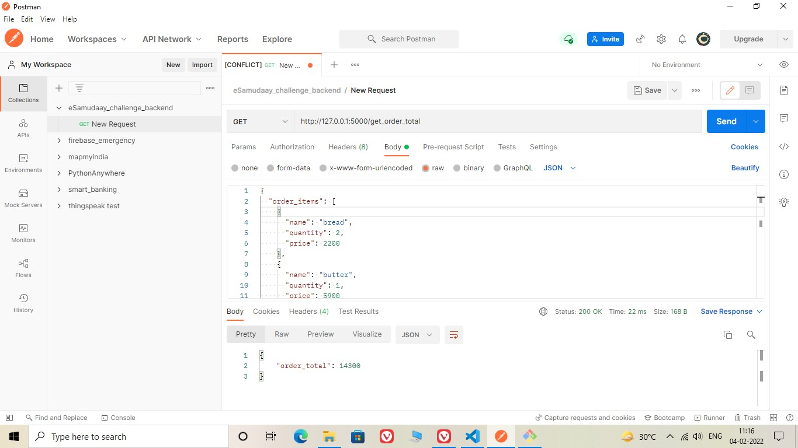
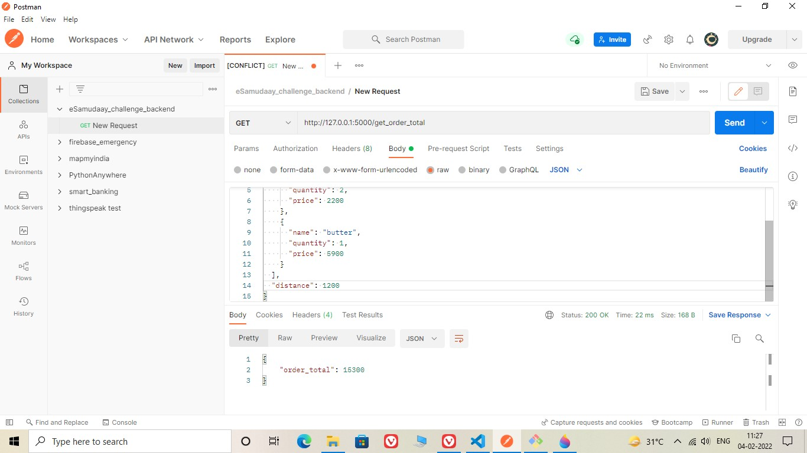

# eSamudaay - Backend take home assignment
# Submitted by Rama Krishna CH (18113189)

## Instructions to Install and run the App:

 - Installation Package cmd: [pip install Flask](https://pypi.org/project/Flask/)

 - Run this cmd from Home Directory: **flask run** or **python app.py**

 - Test this URL in Postman with parameters in body: [http://127.0.0.1:5000/get_order_total](http://127.0.0.1:5000/get_order_total)

 ## About the project:

- **Flask** (Python based Micro web framework) is used in this API project

- The **app.py** is the main file which contains get_order_total route

- The **calculate_order.py** contains the function to calculate the order total

# Screenshot of Working output in POSTMAN:

Sample Input given with FLAT offer

Sample Input given with DELIVERY offer

Sample Input given without offer

